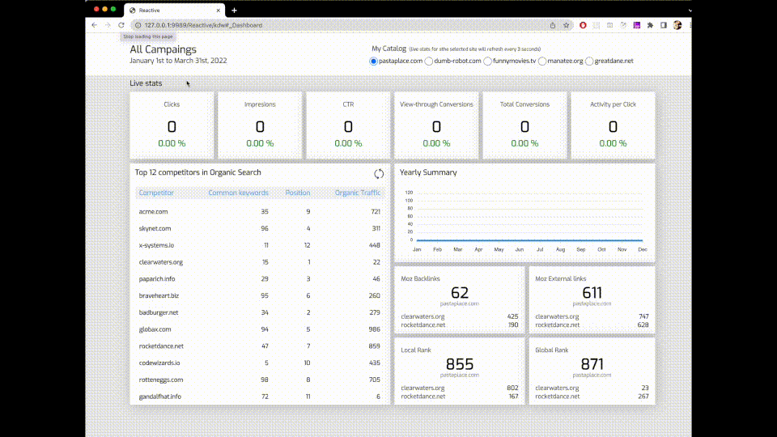

# Kony Visualizer Reactive Sample
## Purpose
<p>
The main purpose is showcase how to build a simple Reactive app in Kony Viz 9.x, and to structure our code in a much modern way (ES6) while increasing the rehusable code across different channels. <br />
This sample consists in a single Form with multiple components that refresh seemingly over certain events. It contains a chart, tiles and a segment that react to changes on the data with less that 50 lines of code in the Form Controller.  
</p>
<p align="center"></p>

### Structure

    .
    ├── ...
    ├── controllers                     
    │   ├── ...                        
    │   └── desktop                     
    │   │   ├── DashboardController.js  # Form controller
    │   │   └── ...                     
    ├── modules                         
    │   ├── App                         
    │   │   ├── App.js                  # Classes containing the different app components
    │   │   ├── initialstate.js         # Initial state object
    │   │   ├── actionlist.js           # List of actions
    │   │   ├── mutations.js            # Functions that change the state
    │   │   └── root.js                 # Returns an instance of the Store
    │   ├── StateManagement             
    │   │   ├── PubSub.js               # Publisher/Subscriber class
    │   │   ├── Store.js                # Store class
    │   └── demodata.js                 # Functions that generate dummy data
    │   └── inmutable.js                # Util library to generate inmutable objects copies
    ├── userwidgets                    
    │   ├── com.konylabs.apexcharts     # Chart component
    │   ├── com.konylabs.tile           # Summary Tile component
    │   └── com.konylabs.tileseo        # SEO data component
    └── ...


### Implementation
<p>
The core implementation is based on Andy Bell's article: [State Management with Vanilla Javascript](https://css-tricks.com/build-a-state-management-system-with-vanilla-javascript/)
</p>
<p>
The central piece is the Store. It contains a state object which represents the application's state, a dispatch function that calls the actions and a commit method that calls the mutations. In the core of the Store object, there is a Proxy-based system that will monitor and broadcast state changes using the PubSub module.
</p>
<p>
From the Form Controller, to react to changes in the state, simply dispatch the actions passing the payload containing the change. This is a sample of how it would work:
  
```
//FormController.js
someFunction: function() {
    var App = require('App');
        
    let myComponent = new App.Component(/* Widget or Array of widgets */); 
    
    // Render the UI based on the initial state
    myComponent.render();
  
    // Dispatch an action with a payload that will change the state and refresh the UI
    store.dispatch('someaction', somePayload);
}
```
</p>

### Notes
<p>
App.js contains all components in a single file, but they could (and they should) be placed on their own files. Visualizer loads the JS modules in alphabetical order and using "require modules" would be the way to go, but the current implementation is not alwasy working as expected for all channels. ES6 capabilities are supported in Visualizer with some exceptions like modules import/export, which would bring a much modern project structuring. 
</p>


